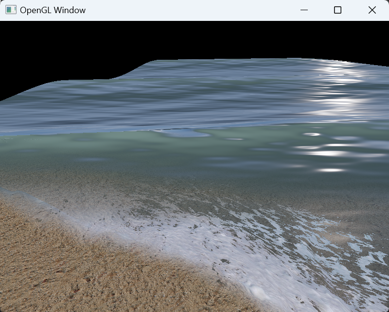
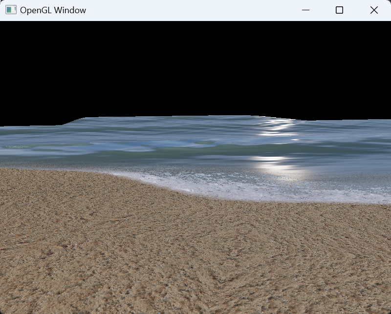

# Beach Rendering Experiment

This repository is a sandbox to play with GLSL shaders and supporting code to make realistic wave action on a beach or at sea.  Inspiration for the project was from a [Path of Exile graphics demo](https://www.youtube.com/watch?v=Do9NB7l4Sx8), and wave math derived from [GPU Gems](https://developer.nvidia.com/gpugems/gpugems/part-i-natural-effects/chapter-1-effective-water-simulation-physical-models).




# Build

Imagery for texture maps are not included with the repository yet, so it won't run out of the box.

```bash
mkdir build
cd build
cmake ..
cmake --build . --config Release
```

# Run Tests
```bash
ctest
```

# Run Render Experiment
```bash
cd bin
./beach.exe
```